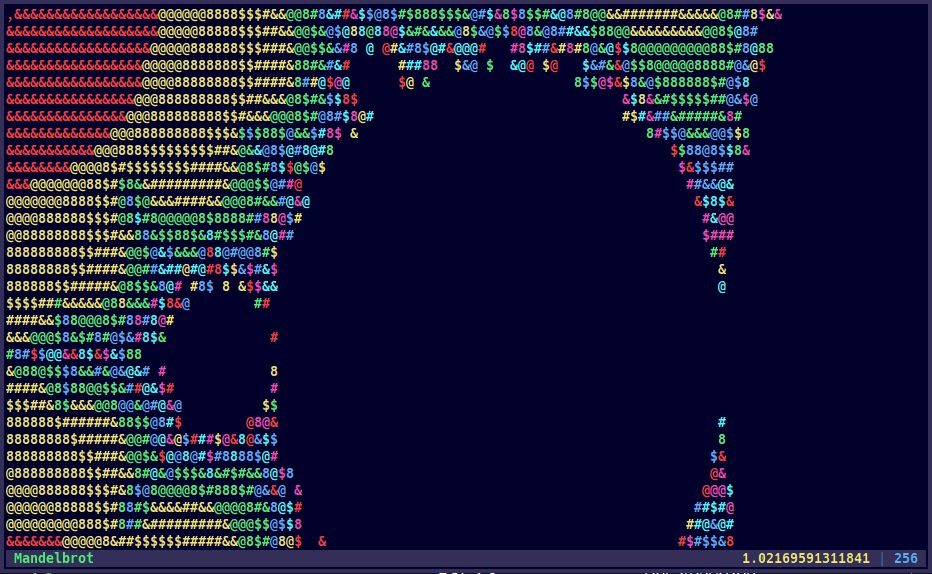

# fractal-cli

View and navigate the Mandelbrot set in glorious 6 color ascii in your terminal
of choice.

200 lines of c all in *main()* because why not.

## Build and Install

Build binary:

    $ make

Install to *~/.local/bin* (or */usr/local/bin* if run as root):

    $ make uninstall

Uninstall:

    $ make uninstall

## Usage

Run in a terminal:

    $ fractal-cli

### Key Bindings

`h j k l`
: move left, down, up, right

`H J K L`
: move left, down, up, right 8 cells

`n p`
: increase, decrease max iterations

`N P`
: increase, decrease max iterations by 8

`i o`
: zoom in, zoom out

`0 R`
: reset

`q Q`
: quit

[BDS0](https://opensource.org/license/0BSD) | [mags](https://mags.zone)

<!--metadata:
author: Chris Magyar <c.magyar.ec@gmail.com>
description: Terminal interface Mandelbrot set viewer.
keywords: Mandelbrot, fractal, terminal
-->
